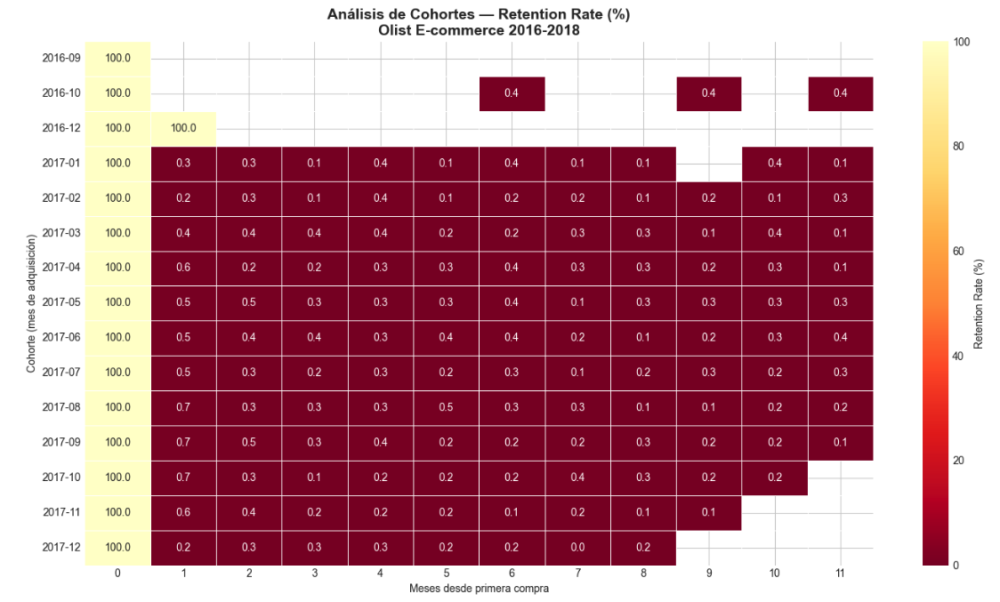

# Olist E-commerce — Cohort Analysis & Retention

Analysis of customer behavior, retention rates and revenue trends 
using real data from Olist, Brazil's largest e-commerce platform.

---

## Tools
- **Python** — Pandas, Matplotlib, Seaborn
- **Dataset** — Olist Brazilian E-commerce (Kaggle)

---

## Files
| File | Description |
|---|---|
| `proyecto3_olist_ecommerce.ipynb` | Main analysis notebook |
| `cohort_analysis.png` | Cohort retention heatmap |

---

## Key Findings

- **R$15.4M** in total revenue across 99k orders (2016-2018)
- **Average ticket: R$153** per order
- **Black Friday 2017** was the peak month with R$1.15M revenue
- **Critical retention problem:** less than 1% of customers make a second purchase
- **97% delivery rate** — highly efficient logistics operation
- Recommendation: implement loyalty program and post-purchase email campaigns

---

## Analysis Structure
1. Data loading and cleaning
2. Monthly revenue analysis
3. Cohort analysis and retention rate
4. Order status funnel

---

## Author
**David Calderón** — Civil Computer Engineer 
